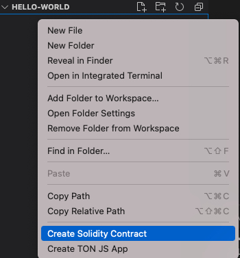
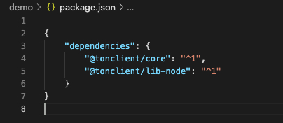

# TONDEV Visual Studio Code plugin

Access [TONDEV](https://docs.ton.dev/) Toolkit functionality directly from popular IDE

# Content Table

- [TONDEV Visual Studio Code plugin](#tondev-visual-studio-code-plugin)
- [Content Table](#content-table)
- [Installation](#installation)
- [Supported operations](#supported-operations)
  - [Solidity](#solidity)
    - [Create your first contract](#create-your-first-contract)
    - [Compile](#compile)
    - [Version](#version)
    - [Update](#update)
  - [C++](#c)
    - [Create your first contract](#create-your-first-contract-1)
    - [Compile](#compile-1)
    - [Version](#version-1)
    - [Update](#update-1)
  - [SDK](#sdk)
    - [Create Demo Project](#create-demo-project)
- [Backlog](#backlog)
  - [Compilers](#compilers)
  - [TS4](#ts4)
  - [Network registry support](#network-registry-support)
  - [Signer registry support](#signer-registry-support)
  - [Contract management support](#contract-management-support)

# Installation

Search for [`TONDev` extention](https://marketplace.visualstudio.com/items?itemName=TONLabs.tondev) in VS Code Marketplace and install it.

# Supported operations
Go to `View -> Command Pallete...` and enter `tondev`. You will see the list of available commands.  
Also some commands can be accessed from context menu of Code Explorer (click on empty area) or files that have `.sol`, `.cpp`, `abi.json` and `.tvc` extensions.

## Solidity

### Create your first contract

This command creates a hello-world Solidity contract with comments that you can observe and compile.

Click on the empty space in Explorer and find `Create Solidity Contract` command or access it from

`View->Command palette->TONDEV: Create Solidity Contract`.

.

We named the contract `Contract`. After command is finished you will see the source code of hello world contract that you can now compile.

.

### Compile

This command compiles and links a selected Solidity contract. After successful compilation you get .abi.json and .tvc files that you can later [use in your DApps to deploy and call contract methods](https://docs.ton.dev/86757ecb2/p/07f1a5-add-contract-to-your-app-/b/462f33).

Find `Compile Solidity Contract` command in the .sol file context menu or access it from 

`View->Command palette->TONDEV: Compile Solidity Contract`

### Version

This command shows the currently installed Solidity compiler version.

Access this command from
`View->Command palette->TONDEV: Show Solidity Version`

### Update

This command updates the compiler to the latest version.

In case you had some problems with installation or want to pull the latest compiler version use this command.
Access it from `View->Command palette->TONDEV: Update Solidity Compiler`

## C++

### Create your first contract

This command creates a hello-world C++ contract with comments that you can observe and compile.

Click on the empty space in Explorer and find `Create C++ Contract` command or access it from

`View->Command palette->TONDEV: Create C++ Contract`.

We named the contract `Contract`. After command is finished you will see the source code of hello world contract that you can now compile.

### Compile

This command compiles and links a selected C++ contract. After successful compilation you get .abi.json and .tvc files that you can later [use in your DApps to deploy and call contract methods](https://docs.ton.dev/86757ecb2/p/07f1a5-add-contract-to-your-app-/b/462f33).

Find `Compile C++ Contract` command in the .sol file context menu or access it from 

`View->Command palette->TONDEV: Compile C++ Contract`

### Version

This command shows the currently installed Solidity compiler version.

Access this command from
`View->Command palette->TONDEV: Show C++ Version`

### Update

This command updates the compiler to the latest version.

## SDK

### Create Demo Project

This command creates a Node.js project with SDK latest dependencies and index.js file with main Client object creation.

Click on the empty space in Explorer and find `Create TON JS App` command or access it from
`View->Command palette->TONDEV: Create TON JS App`.

We named our project `demo`. After command is finished you will see package.json with js sdk dependencies
and index.js file with client creation, connecting to local blockchain [TONOS Startup Edition](https://docs.ton.dev/86757ecb2/p/19d886-ton-os-se).

To connect to the local blockchain you need to run it. [Find out how to launch it here](https://docs.ton.dev/86757ecb2/p/324b55-installation/t/7337a3).  

Client creation:

Dependencies:

# Backlog

## Compilers
- Support other compilation and linking options

## TS4

- Debug contracts with TS framework and tools

## Network registry support
- Support GUI for network management

## Signer registry support
- Support GUI for keys management

## Contract management support
- Support deploy and execution of contracts with nice UI